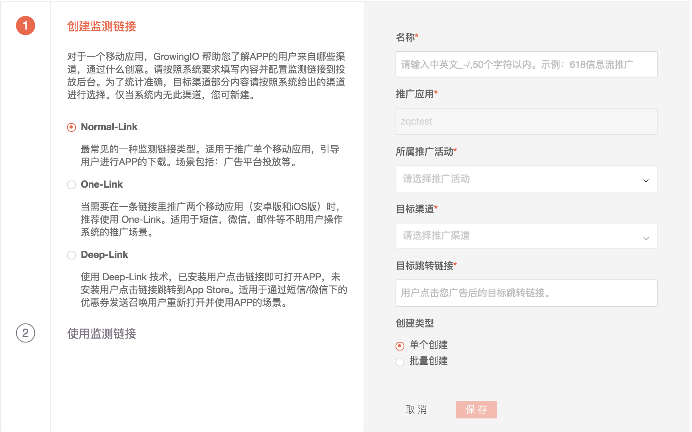
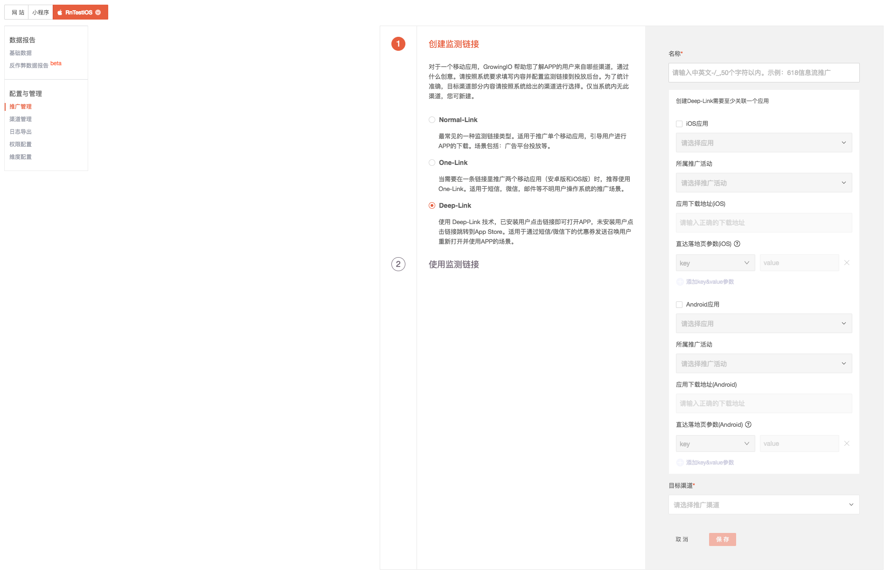
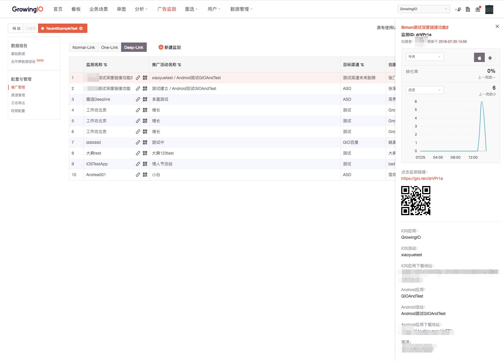

# 推广 App

如果您需要跟踪 App（安卓 or iOS）的推广效果，可以使用此功能。使用之前请确保您的 App 中加载了GrowingIO 的 SDK1.0.3 以上。

* [1.使用方法](app-marketing.md#1)
  * [1.1 新建链接](app-marketing.md#11)
    * [1.1.1 新建普通链接「Normal-Link」](app-marketing.md#111)
    * [1.1.2 One-Link](app-marketing.md#112)
    * [1.1.3 Deep-Link](app-marketing.md#113)
  * [1.2 推广管理](app-marketing.md#12)
* [2.数据报表](app-marketing.md#2-shu-ju-bao-biao)
  * [2.1 基础数据](app-marketing.md#21)
    * [2.1.1 激活概览](app-marketing.md#211)
    * [2.1.2 推广详细](app-marketing.md#212)
  * [2.2 异常数据报告](app-marketing.md#22)
  * [2.3 深度分析](app-marketing.md#23)
* [3.数据说明](app-marketing.md#3-shu-ju-shuo-ming)
* [4.归因逻辑](app-marketing.md#4-gui-yin-luo-ji)
  * [4.1 如何定义用户？用户唯一设备号？](app-marketing.md#51)
  * [4.2 归因规则是？](app-marketing.md#52)
* [5.权限配置](app-marketing.md#5-quan-xian-pei-zhi)
* [6.数据下载与导出](app-marketing.md#6-shu-ju-xia-zai-yu-dao-chu)
  * [6.1 报表数据下载](app-marketing.md#81)
  * [6.2 日志导出](app-marketing.md#82)

### 1. 使用方法 {#1}

### 1.1 新建链接 {#11}

#### 1.1.1 新建普通链接「Normal-Link」 {#111}

1. 点击进入 GIO 后台，广告监测，要推广的 App。
2. 进入“配置与管理”模块“推广管理”，点击“新建监测”。
3. 按照系统要求填写内容。监测链接为您自定义命名，示例：百度618投放。推广活动也是您自定义的维度，如：市场部八月投放等。
4. 根据您要投放的实际渠道进行渠道选择。特别说明：如果系统已经存在的渠道，建议您直接选择。
5. 根据您的实际投放情况选择不同的链接类型。
6. 如果需要生成多条链接，新建过程中可以选择“批量创建”。
7. 获取监测链接（或二维码），用于投放。
8. 按照系统引导创建监测链接。
9. 创建完成后在“推广管理”页面切换“Deep-Link”tab 进行链接管理。
10. 点击每条链接可以在右侧滑出“快速预览”，切换操作系统分别查看 iOS 及安卓的数据。
11. 针对Deep-Link类型，系统在其他类型链接统计指标之外，提供了“唤醒”指标，衡量多少人通过链接重新打开 APP。
12. 在“基础数据” 模块，Deep-Link 类型的链接会分化成形如“监测链接 0327-Deeplink\_iOS ”及“监测链接0327-Deeplink\_Android “两条链接，增加“唤醒”及“唤醒转化率”两个指标。
13. 此功能需要升级到 SDK2.3.0 以上。

  

#### 1.1.2 One-Link {#112}

当你需要使用一条监测链接同时推广 iOS 和安卓 App 时，使用此类型。

1. 填写链接名称并选择您想要投放的应用。
2. 按照系统引导创建链接。
3. 创建过程中，如果名称为“监测链接0327”，完成后在“推广管理”页面切换“One-Link”tab 进行链接管理。
4. 点击每条链接可以在右侧滑出“快速预览”，切换操作系统分别查看 iOS 及安卓的数据。
5. 在“基础数据” 模块，One-Link 类型的链接会分化成形如“监测链接 0327-Onelink\_iOS”及“监测链接 0327-Onelink\_Android“两条链接。

#### 1.1.3 Deep-Link {#113}

当你需要已安装用户站外点击链接可以直接打开 App 时，可以使用 Deep-Link 类型。

1.1.3.1创建Deep-Link

1. 填写链接名称并选择您想要投放的应用。
2. 为这条监测链接选择所属推广活动。
3. 填写应用下载地址。
4. 填写链接对应活动的直达落地页参数（_在App里我们使用URI Scheme来像定位一个网页一样，定位一个应用甚至应用里的某个具体的功能或页面。App中我们定位我的某个功能页面ID为1234的某个具体页面，通常是通过:myapp://com.gio.function?page=1234的URI Scheme来实现。其中，page=1234即为当前活动页的URI，其中key=page，value=1234。请与活动页的开发人员确认页面URI参数的Key/Value值，并填写到直达落地页参数输入框。_）
5. 完成创建，投放应用 。

Notice：为了不影响Deep—Link功能的完整体验，请您配置Universal Link/应用宝微链接。

                配置过程将需要您公司的iOS工程师、具有管理员权限的成员协同进行， [查看配置方法](https://docs.growingio.com/docs/configuration/project-configuration#3)。

1.1.3.2使用Deep-Link

1. 创建完成后在“推广管理”页面切换“Deep-Link”tab 进行链接管理。
2. 点击每条链接可以在右侧滑出“快速预览”，切换操作系统分别查看 iOS 及安卓的数据。
3. 针对Deep-Link类型，系统在其他类型链接统计指标之外，提供了“唤醒”指标，衡量多少人通过链接重新打开 APP。 
4. 在“基础数据” 模块，Deep-Link 类型的链接会分化成形如“监测链接 0327-Deeplink\_iOS ”及“监测链接0327-Deeplink\_Android “两条链接，增加“唤醒”及“唤醒转化率”两个指标。

| Deep-Link功能 | App  SDK版本 |
| :--- | :--- |
| 基础Deeplink功能（Scheme打开APP至首页） | 2.3.0 |
| 直达落地页（Scheme打开至活动页） | 2.3.2 |
| Universal Link/应用宝微链接支持 | 2.4.1 |

注：SDK功能向下兼容。

###  {#12}

### 1.2 推广管理 {#12}

使用推广管理模块进行链接的增删改查。

点击每条链接右侧可以快速滑出快速预览。

### 2.数据报表

### 2.1 基础数据 {#21}

#### 2.1.1 激活概览 {#211}

系统为每个应用统计全部激活，推广激活，自然激活以及新登录和次日留存数据。可分天，分小时查看。

#### 2.1.2 推广详细 {#212}

1. 点击选择您要查看的 App，进入“基础数据” ，“推广详细”模块。
2. 推广数据可分天查看，也可查看今天分小时数据。数据实时提供。
3. 有小箭头的字段支持排序。
4. 有筛选图标的字段支持筛选，支持的字段有：目标渠道，监测链接，推广活动。
5. 点击“自定义列指标”，选择需要的指标数据。可选的指标有：展现，去重点击，点击率，激活，转化率，次日留存，新登录。
6. 查询结果可直接下载。

### 2.2 异常数据报告 {#22}

系统会针对广告投放运行一系列模型&规则识别数据的异常性，并提供相关数据报告。 1. 选中目标 App，进入“基础数据”中“异常数据报告”模块。 2. 可以根据业务诉求进行部分异常数据识别规则配置。 3. 可点击“自定义列指标”进行指标选择，可选择的列指标有：去重点击，激活，异常点击，异常激活。

### 2.3 深度分析 {#23}

GIO 提供事件分析，留存分析，漏斗分析，分群分析。采取以下步骤可以进行不同渠道效果的深度事件分析：

1. 选择分析模块-“事件分析”，新建“事件分析”。
2. 选择要分析的指标。
3. 选择要分析的推广维度，可选维度有：监测链接，推广活动，目标渠道。

以上逻辑可沿用在分群，漏斗分析等地方，引用相关维度即可进行深度分析。

### 3.数据说明

1. 展现：使用展现监测链接后，广告被展现的次数统计之和。
2. 全部点击：链接的点击次数之和。
3. 去重点击：去除短时间大量重复点击后的次数之和。
4. 点击率：去重点击/展现。
5. 激活：App 下载后首次联网打开的设备数。
6. 转化率：激活/去重点击。
7. 次日留存：激活后，第二天再次打开APP的设备数。
8. 新登录：激活后，新注册并登陆的设备数。

### 4.归因逻辑

#### 4.1 如何定义用户？用户唯一设备号？ {#51}

对于安卓应用，GIO 优先使用 IMEI 号进行精准激活匹配，没有 IMEI 的情况下采用 AndroidID 匹配，如果也没有获取到 AndroidID ，则采用 IP+UA 的方式模糊匹配。 对于 iOS 应用，GIO 优先使用 IDFA 进行精准激活匹配，没有 IDFA 则使用 IP+UA 的方式模糊匹配。

#### 4.2 归因规则是？ {#52}

按照 Last Click（最近点击）规则，同时辅以反作弊规则进行归因。系统归因时间窗默认 15 天。

### 5.权限配置

如果希望精确控制不同角色查看广告监测模块中的不同数据，可以使用权限配置模块。特别说明：此模块为高级功能，使用之前请确保您所在组织开通了此功能，详情可垂询相关 CSM。具体使用方法：

1. 为需要被控制权限的群体创建一个角色，比如代理商角色，并将具体用户赋予此角色。
2. 进入“用户管理”，功能权限模块，选中“广告监测”，进行不同模块的功能权限定义。
3. 选择角色及目标用户，选中需要被控制的应用&推广活动。

### 6.数据下载与导出

根据实际需要，GIO 提供不同形式的数据导出。

### 6.1 报表数据下载 {#81}

基础数据部分所有页面查询结果报表都可以通过右侧的“下载”按钮进行报表下载。

### 6.2 日志导出 {#82}

如果需要日志数据，可以通过“日志下载”模块导出日志数据。

1. 点击相应的 App，进入“日志导出”模块。
2. 新建导出任务，填写相应内容，并选择相应时间范围及维度。
3. 任务创建成功后，4 小时内系统会给出结果文件，下载该文件即可。
4. 特别说明:导出的数据为日志数据，包含激活设备号，UA，IP，时间戳相关信息，同时如果是通过推广带来的激活，携带其链接，活动，渠道信息。

除了手动导出方式外，GIO 提供 API 方式导出点击&激活日志。

### 7 维度配置 {#82}

当您需要根据业务情况，希望投放链接可以统计到更多维度数据时，可以使用链接自定义维度配置。

举例，如果您想跟踪不同区域的效果数据，可以在此新建自定义为维度参数“area”，显示名称“区域”。配置后，可以在任一GrowingIO的移动监测链接中使用。形如：https://gio.ren/r3jEmQe 这样的链接，配置“area”自定义维度后，可直接在链接后缀此参数，得到 https://gio.ren/r3jEmQe?area=huabei 的新链接。

进行投放后，增加的“区域”维度可以在事件分析/用户分群/漏斗等模块引用查看“区域”维度中不同值的表现。

其中自定义的维度链接参数需以数字+英文字母表达。显示名称则为在GrowingIO后台中维度的显示名称，可使用中文表达。

1 配置链接维度参数

2 在GIO的短链后拼接定义的维度参数。在推广管理模块创建一条短链，形如：https://gio.ren/r3jEmQe 这样的链接，可以直接使用Query String方式拼接成：https://gio.ren/r3jEmQe?city=beijing 。则投放北京区域可以直接使用此链接。

3 数据查看

在事件分析/分群/漏斗分析等模块中，引用维度“推广城市”查看不同推广城市带来的效果：

