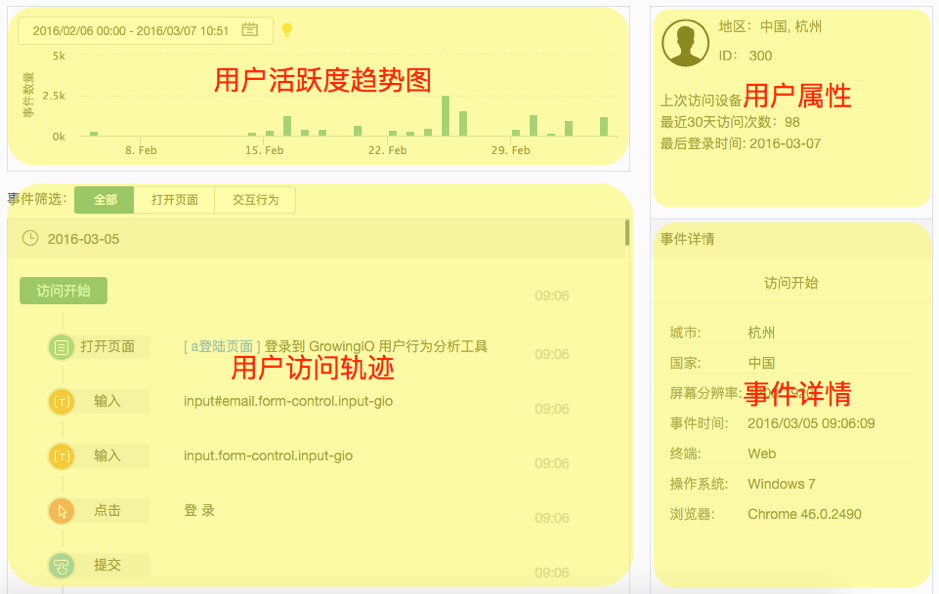
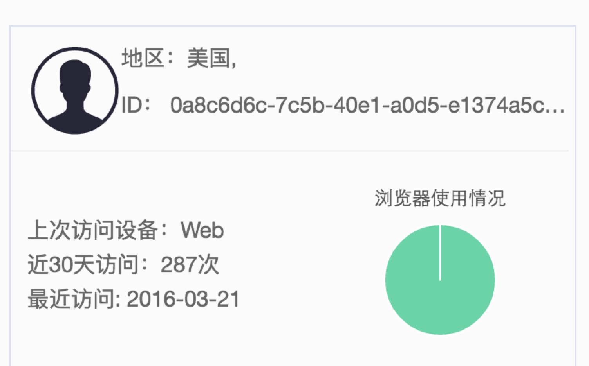

# 用户细查

* [功能简介](individual-user-report.md#gong-neng-jian-jie)
* [功能介绍](individual-user-report.md#gong-neng-jie-shao)
* [应用场景](individual-user-report.md#ying-yong-chang-jing)
  * [案例一](individual-user-report.md#an-li-yi)
  * [案例二](individual-user-report.md#an-li-er)
* [常见问题](individual-user-report.md#chang-jian-wen-ti)

## 功能简介

用户细查可以展示单个用户的详情，以及单个用户在您的网站/应用内的行为流。

用户细查与用户分群功能是紧密相关的。当您定位到您所关心的某一用户群体以后，用户细查可以进一步帮助您了解这个群体内的用户在您的产品内的行为轨迹，从而清晰地展现用户与产品的整个交互过程。在此基础上，您可以根据真实的用户足迹来验证某种猜想；或者从产品使用流程中发现潜在的问题，激发更多的灵感；更具体的，您还可以轻松地跟进您认为具有高价值的用户，了解他们对产品的使用情况。

## 功能介绍

进入用户细查有两种方式：

1. 先进入【用户分群】，点击设定好的某个用户分群后，该群体的所有用户就会以列表形式显示。点击任意一个用户名，即可进入该用户的用户细查页面。
2. 直接在左侧菜单栏中进入【用户细查】，我们为您提供一个默认的“今日访问用户”细查。您就可以看到今日最近一小时的部分访客。此外，您也可以点击左上角的分群列表，在这里选择你创建好的用户分群。
3. 关于用户名：如果当前用户分群的用户类型为“访问用户ID”，则用户名会显示为GrowingIO系统生成的字符串。如果当前用户分群的用户类型为“注册用户ID”，则用户名为您通过属性数据上传的user编号。

**用户细查的界面主要分为四部分：**

* 用户属性

  该板块位于界面右上方，展示了用户头像、用户ID、地区、上次访问的设备、最近30天访问次数及最后登录时间。

上次访问设备： 指用户最后一次访问时使用的手持设备，当使用 PC 访问的时，显示的是 Web.

浏览器使用情况：是指用户在30天内使用浏览器的概况。这是一个比例图，分别表示了用户最常使用浏览器的比率。 当比率为：100% 的时候，表示用户仅使用某一种浏览器访问。

* 用户活跃度趋势图

  这个图反映了用户一段时间内在您产品内的活跃度。其中横坐标表示日期，纵坐标是当天用户所产生的事件总数量。

活跃度趋势图默认显示最近30天的数据，您也可以在右上角的日历中选择任意时间段（不超过30天）来查看活跃度。

除了通过日历选择时间段，您还可以直接在柱图中通过鼠标直接框选一个时间段来放大查看：

您还可以直接点击某一天的柱图来看这位用户在这一天的事件总数分布：

继续点击柱图可以继续放大，观察到小时级别、分钟级别甚至秒级别的用户动态。

无论通过日历来选择时间段，或通过框选或点击来放大时间段的时候，“用户访问轨迹” 都会根据这里的时间段而显示对应时间段的行为流。

* 用户访问轨迹

  在这里展示了该用户在您的产品内的所有使用行为，这些行为包括打开页面和点击/输入/选择/提交四种互动行为，可以在最上方的“事件筛选”中切换。

默认会按照日期从近到远的顺序来显示行为轨迹，即最先显示今天的行为轨迹，然后显示昨天的，前天的，更早的行为……

而在一天之内，所有的行为是按照时间顺序从先到后排列的，即在同一天之内，第一行的行为表示用户的第一个行为。例如，在下图的示例中，这位用户先打开了“Growing \| Growing”页面，然后在5秒后点击了“新建”，而不是反过来。

所有的行为流中，“访问开始”和“访问结束”都表示一次会话（session）的开始和结束。

除了使用“事件筛选”外，还可以使用最顶部的搜索框来找出特定行为。在搜索框中输入并按回车即可筛选出相应的行为，关键词将会自动以高亮形式出现。

* 事件详情

  当在“用户访问轨迹”中点击任意一条行为记录，右侧的“事件详情”中将会显示该事件的更多信息。

（上图左为一次打开页面事件的详情，右为一次点击事件的详情）

如果这条记录中相应的页面或点击的元素是曾经被“圈选”过的，那么则会在事件详情中显示【定义】，即这个对应的元素在圈选时保存的标签名字。如果没有被圈选过，则不会显示定义。

## 应用场景

### 案例一

某在线旅游平台想了解哪些旅游产品的购买率更高，然后推出更多类似的产品，带来利润增长。该客户通过使用购买行为转化率等分析方法找到了一些购买率较高的产品，但这些产品的各种特征如价格、地域、类别等没有很明显的规律。此时我们先通过用户分群，找出“购买了产品A”的所有用户，并在这些用户中任意选择一位来查看用户细查，观察用户是如何与该平台进行交互的：

通过查看一些典型用户的访问轨迹，我们发现这些用户大部分都有“查看全部评论”这一行为，并会在这一页面上停留较长时间。在进一步查看这些评论以后，我们发现这些产品的评分都在4.5/5以上，并且有大量图文并茂的详细评论。而购买率较低的产品则不具备这些用户行为，即使有些产品是客户主推的、预期较高的。

因此我们提出了一个大胆假设：由于旅游产品多数价格较高，用户在产生购买行为时比较谨慎，所以正面的评论能很大程度上加强用户购买的意向。建议在后续的产品优化中，设计一种能刺激用户提交评论的激励机制，并筛选优质评论展示在产品页面，以提高产品提高购买率。

### 案例二

提升购买率的第一步在于刺激用户购买的欲望，而第二步则是确保用户能够成功完成订单，为企业产生盈利。还是这家在线旅游平台，通过对于购买流程的数据分析发现，用户从产生购买行为到确认订单的平均转化率仅为60%左右。基于这个事实，我们可以提问：用户为什么在这一步中流失？如何流失的？

此时我们先通过用户分群，筛选出在购买流程中流失的所有用户，再通过“用户细查”来观察用户在购买流程中的交互行为。

通过查看一些用户的访问轨迹，我们发现了一个常见的行为模式。下图为一个典型用户的行为轨迹，该用户先访问了某一个目的地的旅游产品页面，在该页面上进行了一些“点击”“选择”的行为，然后进入了订单填写的页面。但是该用户在订单填写页没有进行任何行为，而是返回到了产品的页面，继续进行“点击”“选择”。如此反复三次，并且每次在产品页面产生的事件内容都有差异。而最终该用户没有完成支付就结束访问了。

结合这个在线旅游平台的产品形态，我们可以进一步分析该用户的行为。产品页面上需要用户选择出行时间、出行人数以及出行方式等，而订单页面上不能修改这些信息。该用户在产品页面和订单页面反复访问，并且在产品页面修改了填写的信息，由此我们可以猜测：用户在进入订单填写的页面后，想要修改某些信息，但订单页面并没有提供可修改的地方，导致用户不得不回退到产品页面进行修改，再把其他所有的信息重填一遍。在这个过程中用户失去了耐心，最终没有完成支付就离开了。

由此，建议在后续产品的优化中，在订单页面增加让用户可以修改订单信息的选项，满足用户调整选项的需求，优化产品体验，从而提高最终的购买转化率。

## 常见问题

#### 1.为什么用户细查的时序有时候不对? {#1为什么用户细查的时序有时候不对}

1. 在用户细查中，我们是按照用户访问的 session 倒序排列的，session 内的事件是按照时间先后顺利排列的；
2. 细查中事件时间对应的是 GrowingIO 服务器收到的该事件的时间，而不是客户端记录的事件发生时间，需要说明的是，大部分情况下客户端时间和服务器时间的差异很小。使用服务器时间的原因是很多时候客户端时间不可信（比如电脑时间没有同步服务端，导致与服务端时间相差几分钟或者 1 个时区；比如某个用户将自己的手机时间年份设置为 1990 年，实际年份为 2016 年），因此需要在服务端做时间校正；校正时没有考虑网络请求所花费的时间，带来的影响是网络波动的时候有可能就会出现事件的时序是不完全正确的。

#### 2.APP端用户细查里的页面名字是什么？ {#2app端用户细查里的页面名字是什么？}

识别的名称是您开发写的页面名称。如果您有定义过该页面，那么显示的就是定义的指标名称。

